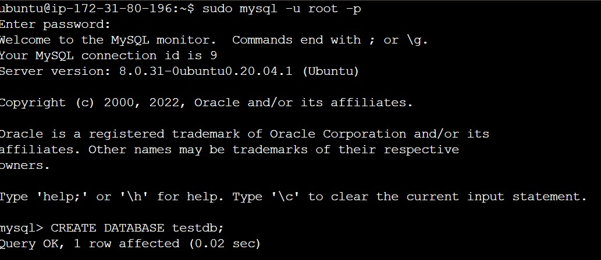

# CLIENT-SERVER ARCHITECTURE WITH MYSQL

I created two (2) linux-based virtual servers i.e. EC2 instances in AWS with Ubuntu operating system.
* Server A -  servermysql
* Server B -  clientmysql

I installed mysql-client on **clientmysql** 
```bash
sudo apt update
sudo apt install mysql-client
```


and mysql on **servermysql**
```bash
sudo apt update
sudo apt install mysql
```

I ran the command to access mysql root on **servermysql**

```bash
sudo mysql -u root -p
```
And created a database named 'testdb'



I opened port 3306 used for mysql on **servermysql**
and allowed access only to the specific IP address of **clientmysql**.


The **clientmysql** was configured with the default access ports.


I configured MySQL server on **servermysql** to allow connections from remote host by opening mysqld.conf with 'vi' text editor and replacing the bind-address value of '127.0.0.1' with '0.0.0.0' 

```bash
    sudo vi /etc/mysql/mysql.conf.d/mysqld.cnf
```
I created a new user with the private address of **clientmysql** and also created a password.


I accessed the database using the newly created user profile and password from **clientmysql** successfully.


****SELF REFLECTION****

I had challenges creating the user and had to restart the whole project on new EC2 instances. I would carry out more research to understand databases and their configurations.


